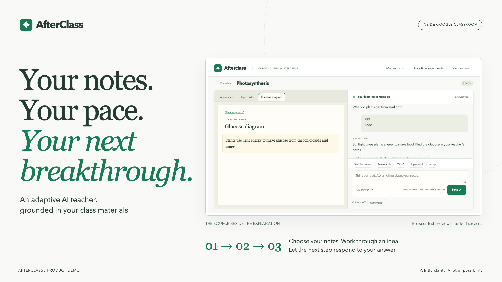
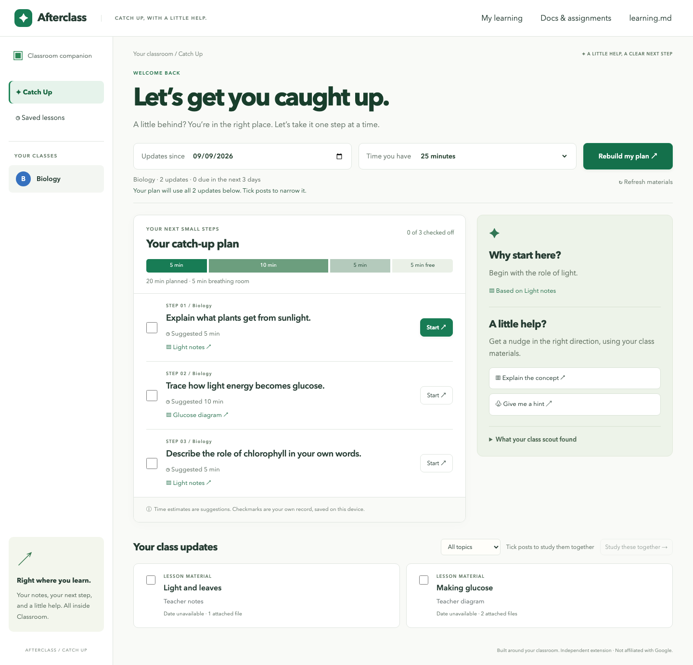
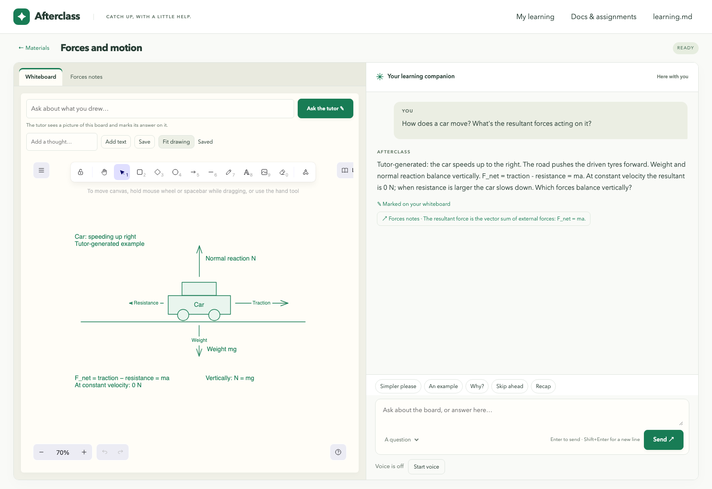

<a id="readme-top"></a>

[![CI][ci-shield]][ci-url]
[![Contributors][contributors-shield]][contributors-url]
[![Stars][stars-shield]][stars-url]
[![Issues][issues-shield]][issues-url]

<div align="center">
  <a href="https://github.com/EdmundLimBoEn/agents-everywhere-2026">
    
  </a>

  <h1>AfterClass</h1>

  <p>
    An adaptive AI teacher inside Google Classroom.<br>
    Your notes. Your pace. Your next breakthrough.
  </p>

  <p>
    <a href="docs/README.md"><strong>Explore the docs »</strong></a>
    <br><br>
    <a href="#demo-walkthrough">Try the demo</a>
    &middot;
    <a href="assets/afterclass-pitch-deck.pdf">Pitch deck</a>
    &middot;
    <a href="https://github.com/EdmundLimBoEn/agents-everywhere-2026/issues/new?title=Bug%3A%20">Report a bug</a>
    &middot;
    <a href="https://github.com/EdmundLimBoEn/agents-everywhere-2026/issues/new?title=Feature%3A%20">Request a feature</a>
  </p>
</div>

<details>
  <summary>Table of Contents</summary>
  <ol>
    <li><a href="#about-the-project">About the Project</a>
      <ul>
        <li><a href="#built-with">Built With</a></li>
        <li><a href="#how-it-works">How It Works</a></li>
      </ul>
    </li>
    <li><a href="#getting-started">Getting Started</a>
      <ul>
        <li><a href="#prerequisites">Prerequisites</a></li>
        <li><a href="#installation">Installation</a></li>
      </ul>
    </li>
    <li><a href="#usage">Usage</a>
      <ul>
        <li><a href="#product-gallery">Product Gallery</a></li>
        <li><a href="#demo-walkthrough">Demo Walkthrough</a></li>
      </ul>
    </li>
    <li><a href="#testing">Testing</a></li>
    <li><a href="#roadmap">Roadmap</a></li>
    <li><a href="#contributing">Contributing</a></li>
    <li><a href="#license">License</a></li>
    <li><a href="#contact">Contact</a></li>
    <li><a href="#acknowledgments">Acknowledgments</a></li>
  </ol>
</details>

## About the Project

[](assets/brand/README.md)

Students already have their teacher's notes in Classroom. AfterClass turns those materials into a lesson that checks what they understand and changes what it teaches next, without leaving their class.

Select real posts, open their documents beside the lesson, and ask questions across the sources. Explanations cite passages you can click to read. When you are behind, **Catch Up** turns the selected posts and the time you have into a short, cited plan.

- **Learn from your class:** readable source tabs and citations tied to the selected materials.
- **Get teaching that adapts:** a diagnostic, explanation, practice, teach-back, and recap, with targeted reteaching when an answer reveals a gap.
- **Catch up within your time budget:** a Class Scout, Planner, Tutor, and Reviewer build and adjust the next study steps.
- **Work through ideas visually:** draw on a shared whiteboard, ask the tutor about your sketch, or have it teach by building a diagram step by step. Voice is optional.
- **Make progress on assignments:** inspect source-linked requirements, save your own draft, request hints, and review gaps before submitting it yourself in Classroom.
- **Resume your learning:** lessons, whiteboards, drafts, learner preferences, and assessment evidence persist locally.

AfterClass runs as an unpacked Chrome extension with a local backend. The separate **Docs & assignments** editor can create and update Google Docs and Classroom assignments after user review. Google account permissions still apply; AfterClass does not submit student work or pass back grades.

### Built With

| Technology | Role |
| --- | --- |
| [TypeScript](https://www.typescriptlang.org/) | Extension, study UI, services, and shared types |
| [Chrome Extensions / Manifest V3](https://developer.chrome.com/docs/extensions/) | Same-tab Classroom overlay and Google sign-in |
| [Bun](https://bun.sh/) and [SQLite](https://www.sqlite.org/) | HTTP server, builds, tests, and local persistence |
| [Google Classroom](https://developers.google.com/workspace/classroom), [Drive](https://developers.google.com/workspace/drive), and [Docs](https://developers.google.com/workspace/docs) APIs | Authorized class materials and reviewed authoring |
| [OpenAI](https://platform.openai.com/docs/) | Structured tutor and crew responses, document reading, and optional Realtime voice |
| [Excalidraw](https://github.com/excalidraw/excalidraw) with [React](https://react.dev/), plus [PDF.js](https://mozilla.github.io/pdf.js/) | Interactive whiteboard and PDF support within the vanilla TypeScript UI |
| [Playwright](https://playwright.dev/) | Browser and unpacked-extension checks |

### How It Works

| Piece | Source | Responsibility |
| --- | --- | --- |
| Extension | [`app/apps/extension`](app/apps/extension) | Select real Classroom posts, open the overlay, and handle Google authorization in the service worker |
| Study UI | [`app/apps/web`](app/apps/web) | Catch Up dashboard, source reader, lesson thread, assignment workspace, whiteboard, and voice controls |
| API | [`app/services/api`](app/services/api) | Verify Google access and persist lessons, plans, drafts, and evidence in SQLite |
| Classroom client | [`app/services/classroom`](app/services/classroom) | Retrieve authorized posts, deadlines, and passages from attachments |
| Tutor and crew | [`app/services/agent`](app/services/agent) | Generate structured responses, validate citations and plan budgets, and enforce lesson-state transitions |
| Voice | [`app/services/realtime`](app/services/realtime) | Issue short-lived sessions for optional voice |
| Shared contracts | [`app/packages`](app/packages) | Lesson types, Classroom route parsing, and the [OpenAPI contract](app/packages/openapi/openapi.json) |

The extension worker sends Google authorization to the configured backend for access checks and retrieval; the Classroom page does not receive the token. OpenAI credentials remain on the backend. Retrieved lesson content and student responses are sent to OpenAI for teaching. See [data, permissions, and recovery](docs/build-and-run.md) and the [lesson state machine](docs/lesson-state-machine.md) for details.

<p align="right">(<a href="#readme-top">back to top</a>)</p>

## Getting Started

### Prerequisites

- Git and [Bun](https://bun.sh/); CI uses Bun **1.3.14**.
- Google Chrome **120 or newer**, with permission to load an unpacked extension.
- A Google account with access to a real Classroom class and its attachments.
- A Google Cloud project where you can enable the Classroom, Drive, and Docs APIs and configure an OAuth client.
- An OpenAI API key with access to the configured teaching model. Voice also needs access to the configured Realtime model and microphone permission.

### Installation

1. Clone the repository and install the locked dependencies:

   ```sh
   git clone https://github.com/EdmundLimBoEn/agents-everywhere-2026.git
   cd agents-everywhere-2026/app
   bun install --frozen-lockfile
   cp .env.example .env
   ```

2. Configure Google Cloud:

   - Enable the **Google Classroom API**, **Google Drive API**, and **Google Docs API**.
   - Configure the OAuth consent screen and add your accounts as test users while the app is in testing. School accounts may require administrator approval.
   - Create a **Chrome extension OAuth client** for the bundled extension ID: `pdilhkaadeldjlpcnpebmhfchkoankec`.

   Follow the [Google configuration guide](docs/build-and-run.md#google-configuration) for the requested scopes and troubleshooting.

3. Edit `.env` in the current `app/` directory before building:

   | Variable | Configuration |
   | --- | --- |
   | `GOOGLE_CLIENT_ID` | The Chrome extension OAuth client ID from step 2 |
   | `OPENAI_API_KEY` | Your server-side OpenAI API key |
   | `OPENAI_MODEL` | Keep the preset in `.env.example`, or select an accessible model with structured-output support |
   | `OPENAI_REALTIME_MODEL` | The model used for optional voice; a preset is included |
   | `API_ORIGIN` | Defaults to `http://localhost:8787`; keep it consistent with `HOST` and `PORT` |

   Keep credentials out of Git. Optional account allowlists, storage settings, and origin overrides are documented in [Build and run](docs/build-and-run.md#local-setup).

4. Build and start the backend from `app/`:

   ```sh
   bun run build
   bun run start
   ```

5. Open `chrome://extensions`, enable **Developer mode**, click **Load unpacked**, and select `app/dist/extension` from the repository. Confirm that its ID matches the OAuth client.

6. Open [Google Classroom](https://classroom.google.com/), enter a class, click **Study notes**, and connect Google with an account that can read the selected materials.

Keep the backend running while using the extension. After rebuilding, reload both the extension and the Classroom tab. Changing `GOOGLE_CLIENT_ID` or `API_ORIGIN` requires a rebuild.

The local page at [localhost:8787](http://localhost:8787) is a preview of the study UI; Google sign-in still happens through the extension. Full setup and recovery instructions are in [Build and run](docs/build-and-run.md).

<p align="right">(<a href="#readme-top">back to top</a>)</p>

## Usage

### Product Gallery

Current app interface — browser-test preview with mocked services. These captures use existing synthetic test fixtures; they do not demonstrate live Google authorization or model responses. See [screenshot provenance](assets/brand/README.md#screenshot-provenance).

| Catch Up dashboard | Shared whiteboard |
| --- | --- |
| [](assets/brand/screenshots/catch-up-desktop.png) | [](assets/brand/screenshots/whiteboard-forces.png) |

[Lesson and citations](assets/brand/screenshots/lesson-citations.png) · [Narrow-viewport preview](assets/brand/screenshots/catch-up-mobile.png) · [Brand kit ZIP](assets/afterclass-brand-kit.zip)

Presentation resources: [pitch deck PDF](assets/afterclass-pitch-deck.pdf), [editable PowerPoint](assets/afterclass-pitch-deck.pptx), and [submission guide](docs/submission.md). The deck is the existing hackathon presentation; the [current brand kit](assets/brand/README.md) supplies the latest identity and artwork.

### Demo Walkthrough

1. Open a real class. Stream, Classwork, and the original attachment links continue to work.
2. Select two posts with readable attachments and click **Study these together**.
3. In **Catch Up**, choose **Updates since** and **Time you have**, then click **Build my plan**. Click **Start** on the first cited step.
4. Ask a question that needs both documents. Click a citation to open the supporting passage beside the lesson.
5. Start **Teach me**, answer the diagnostic, and try an incorrect answer to see targeted reteaching and a plan adjusted around the gap. Interrupt with “Explain that more simply” or “Give me an example.”
6. On **Whiteboard**, sketch an idea and ask about it. The tutor marks its answer next to your shapes. **Teach me at the whiteboard** builds a diagram as the lesson progresses.
7. Explain the idea back and read the recap of what you demonstrated and what to revisit.
8. Close the overlay to return to the same Classroom page. Reopen it to resume.

For assignment help, choose **Work on this assignment**, inspect the requirements, write and save your draft, then request a hint or review. **Copy my draft** lets you take your work back to Classroom and submit it yourself. See the [assignment walkthrough](docs/build-and-run.md#work-on-the-assignment-in-front-of-you).

The complete [demo script and acceptance checks](docs/hackathon-scope.md) use actual class materials. Catch Up checkmarks are self-reported; they do not record mastery, attendance, or assignment submission.

<p align="right">(<a href="#readme-top">back to top</a>)</p>

## Testing

Run these commands from `app/`:

```sh
# TypeScript checks, service/extension tests, and production bundles
bun run check

# Browser and unpacked-extension checks
bunx playwright install chromium
bun run test:e2e
```

If port 8787 is occupied, use `E2E_PORT=8798 bun run test:e2e` for a separate test server. Individual commands are available in [`app/package.json`](app/package.json): `typecheck`, `test`, and `build`.

[CI](.github/workflows/ci.yml) runs the checks and Chromium tests with mocked integrations. Live-provider tests are opt-in. Browser fixtures do not verify school OAuth, real Classroom documents, model availability, or microphone/WebRTC connectivity; use the [live acceptance checks](docs/hackathon-scope.md#acceptance-checks-before-demo) before demonstrating those integrations.

Run `bun run audit` to check the locked dependencies for known vulnerabilities. CI enforces this alongside the tests. The [release guide](docs/release-readiness.md) covers the supported local deployment, backups, dependency overrides, and remaining live-account checks.

<p align="right">(<a href="#readme-top">back to top</a>)</p>

## Roadmap

The current milestone is a local hackathon build with these implemented capabilities:

- [x] Same-tab Classroom extension and authorized material retrieval.
- [x] Cited lessons with diagnostics, adaptive teaching, and saved learner evidence.
- [x] Time-budgeted Catch Up planning with a scout, planner, tutor, and reviewer.
- [x] Persistent whiteboard with tutor annotations and optional voice.
- [x] Student assignment drafts, hints, and requirement reviews.
- [x] Reviewed Google Docs and Classroom assignment authoring.

See the [product requirements](docs/prd.md) and [demo scope](docs/hackathon-scope.md) for acceptance criteria, and [open issues][issues-url] for reported problems and feature proposals. Grade passback, student turn-in, teacher dashboards, and Marketplace distribution are outside the current scope.

<p align="right">(<a href="#readme-top">back to top</a>)</p>

## Contributing

Start with an [issue][issues-url] describing the problem or proposed change, then:

1. Fork the repository and create a focused branch, for example `git switch -c PinZheng/improve-source-navigation`.
2. Make the change, update the relevant docs, and add regression coverage for changed behavior.
3. Run `bun run check` from `app/`, plus the browser checks for UI or extension changes.
4. Commit and push to your fork. Use `<area>(<type>): <short summary>` for commit subjects and PR titles, such as `docs(docs): clarify Google setup`. Include the change, rationale, and validation in the commit body.
5. Open a pull request describing the resulting behavior and checks performed.

Keep Classroom as the product's home. Use actual authorized class materials for demos; do not invent sample PDFs or silently substitute demo content when retrieval fails. Synthetic content belongs in clearly labeled tests. For agent-assisted work, do not create commits unless asked.

| Directory | Contents |
| --- | --- |
| [`app/`](app/) | Extension, study UI, services, shared packages, and tests |
| [`docs/`](docs/) | Product requirements, setup, teaching loop, and demo checks |
| [`notes/`](notes/) | School PDFs to post as materials in the demo class |
| [`assets/`](assets/) | Current brand kit, product screenshots, illustrations, and pitch deck |

See the [project contributors][contributors-url] for the people behind AfterClass.

<p align="right">(<a href="#readme-top">back to top</a>)</p>

## License

No project license is currently declared in this repository.

<p align="right">(<a href="#readme-top">back to top</a>)</p>

## Contact

For questions, bugs, or feature proposals, open a [GitHub issue][issues-url].

Project: [EdmundLimBoEn/agents-everywhere-2026](https://github.com/EdmundLimBoEn/agents-everywhere-2026).

<p align="right">(<a href="#readme-top">back to top</a>)</p>

## Acknowledgments

- [Best-README-Template](https://github.com/othneildrew/Best-README-Template) for this README's structure.
- [Excalidraw](https://github.com/excalidraw/excalidraw) and [PDF.js](https://github.com/mozilla/pdf.js) for the whiteboard and PDF tooling.
- [Shields.io](https://shields.io/) for repository badges.
- The [AfterClass brand kit](assets/brand/README.md) for the current identity and product captures, and the [illustration collection](assets/afterclass/README.md) for Catch Up, whiteboard, and lesson-recap artwork.

<p align="right">(<a href="#readme-top">back to top</a>)</p>

[ci-shield]: https://github.com/EdmundLimBoEn/agents-everywhere-2026/actions/workflows/ci.yml/badge.svg
[ci-url]: https://github.com/EdmundLimBoEn/agents-everywhere-2026/actions/workflows/ci.yml
[contributors-shield]: https://img.shields.io/github/contributors/EdmundLimBoEn/agents-everywhere-2026?style=flat-square
[contributors-url]: https://github.com/EdmundLimBoEn/agents-everywhere-2026/graphs/contributors
[stars-shield]: https://img.shields.io/github/stars/EdmundLimBoEn/agents-everywhere-2026?style=flat-square
[stars-url]: https://github.com/EdmundLimBoEn/agents-everywhere-2026/stargazers
[issues-shield]: https://img.shields.io/github/issues/EdmundLimBoEn/agents-everywhere-2026?style=flat-square
[issues-url]: https://github.com/EdmundLimBoEn/agents-everywhere-2026/issues
